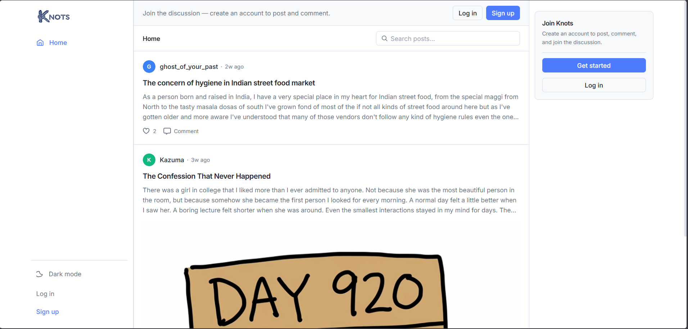
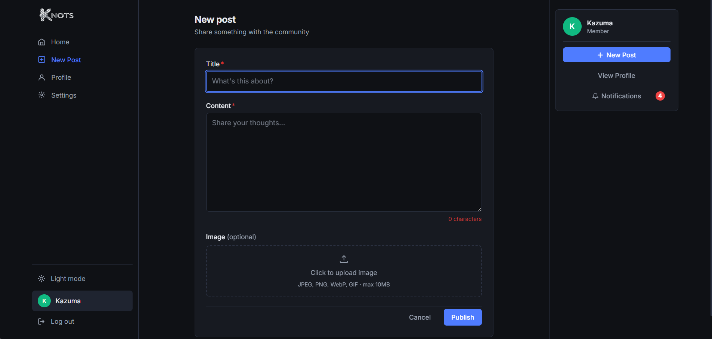
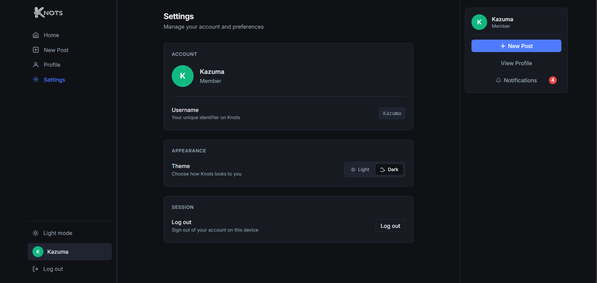

<p align="center">
  
</p>

<h1 align="center">Knots</h1>

<p align="center">
  <strong>A full-stack social blogging platform with real-time notifications and AI-powered moderation</strong>
</p>

<p align="center">
  <a href="#features">Features</a> •
  <a href="#demo">Demo</a> •
  <a href="#screenshots">Screenshots</a> •
  <a href="#tech-stack">Tech Stack</a> •
  <a href="#api-reference">API Reference</a> •
  <a href="#getting-started">Getting Started</a>
</p>

<p align="center">
  
  
  
  
  
  
  
</p>

---

<p align="center">
  
</p>

---

## Why Knots?

Most blogging platforms are passive — you post, others read. **Knots** is built around engagement.

- Write posts and share images with your community
- Get **instant notifications** when someone likes or comments — no refresh needed
- AI automatically **moderates toxic comments** before they reach your community
- **Search posts by keyword** and browse with pagination
- Light and dark mode for comfortable reading

---

## Demo

🔗 **Live Application:** [knots-smoky.vercel.app](https://knots-smoky.vercel.app)

> **Note:** The backend is hosted on Render's free tier and may take 30–60 seconds to wake up on the first request. Email verification is fully implemented — check your spam folder if the email doesn't arrive in your inbox.

---

## Screenshots

### Home Feed
<p align="center">
  
</p>

### Create Post
<p align="center">
  
</p>

### Settings
<p align="center">
  
</p>

---

## Features

<table>
<tr>
<td width="50%">

### JWT Authentication
Secure login and registration with JWT access tokens, email verification, and password reset flow.

</td>
<td width="50%">

### Real-Time Notifications
Instant like and comment notifications via Socket.io — delivered the moment they happen.

</td>
</tr>

<tr>
<td>

### AI Content Moderation
Google Gemini automatically flags and blocks toxic comments before they're saved to the database.

</td>
<td>

### Image Uploads
Attach images to posts with direct Cloudinary integration via Multer.

</td>
</tr>

<tr>
<td>

### Likes System
Toggle likes on any post with live like counts and per-user like status on the feed.

</td>
<td>

### Pagination & Search
Browse posts with server-side pagination and search by keyword across all post titles.

</td>
</tr>

<tr>
<td>

### Light & Dark Mode
Clean theme switching with persistent preference across sessions.

</td>
<td>

### Rate Limiting
All API routes protected against brute-force and abuse with express-rate-limit.

</td>
</tr>
</table>

---

## Tech Stack

### Backend
```
Node.js + Express      REST API server
MongoDB + Mongoose     Database and ODM
JWT                    Authentication
Socket.io              Real-time notifications
Cloudinary + Multer    Image uploads
Google Gemini API      AI comment moderation
Gmail OAuth2           Transactional emails
express-validator      Input validation
express-rate-limit     Rate limiting
```

### Frontend
```
React 18 + Vite        UI framework
React Router v6        Client-side routing
Tailwind CSS           Styling
Framer Motion          Animations
Axios                  HTTP client
Socket.io-client       Real-time events
Zustand                State management
```

---

## Architecture

```
Frontend (React + Vite) — Vercel
         │
         │  REST API (HTTP) + WebSockets
         ▼
Backend (Node.js + Express + Socket.io) — Render
         │
         ▼
  MongoDB Atlas (Cloud Database)

External Services
  Cloudinary   → image storage
  Gemini API   → comment moderation
  Gmail OAuth2 → transactional emails
```

---

## Project Structure

```
knots/
├── backend/
│   ├── config/
│   │   ├── cloudinary.js
│   │   ├── mailer.js
│   │   └── passport.js
│   ├── controllers/
│   │   ├── authController.js
│   │   ├── postController.js
│   │   ├── commentController.js
│   │   └── aiController.js
│   ├── middleware/
│   │   └── auth.js
│   ├── models/
│   │   ├── User.js
│   │   ├── Post.js
│   │   ├── Comment.js
│   │   └── Notification.js
│   ├── routes/
│   │   ├── auth.js
│   │   ├── posts.js
│   │   ├── comments.js
│   │   ├── notifications.js
│   │   └── ai.js
│   └── server.js
│
├── frontend/
│   ├── src/
│   │   ├── app/
│   │   ├── components/
│   │   ├── hooks/
│   │   ├── pages/
│   │   ├── services/
│   │   └── styles/
│   ├── vercel.json
│   └── package.json
│
└── README.md
```

---

## API Reference

### Authentication
| Method | Endpoint | Description |
|---|---|---|
| POST | /signup | Register a new user |
| POST | /login | Login and receive JWT |
| GET | /verify?token=... | Verify email address |
| POST | /forgot-password | Request password reset email |
| POST | /reset-password?token=... | Reset password |

### Posts
| Method | Endpoint | Description |
|---|---|---|
| GET | /posts | Get all posts (paginated + searchable) |
| POST | /posts | Create a post (with optional image) |
| PUT | /posts/:id | Update a post |
| DELETE | /posts/:id | Delete a post |
| POST | /posts/:id/like | Toggle like on a post |
| GET | /posts/:id/likes | Get users who liked a post |

### Comments
| Method | Endpoint | Description |
|---|---|---|
| GET | /posts/:id/comments | Get all comments for a post |
| POST | /posts/:id/comments | Add a comment (AI moderated) |
| DELETE | /posts/:id/comments/:cId | Delete a comment |

### Notifications
| Method | Endpoint | Description |
|---|---|---|
| GET | /notifications | Get all notifications |
| GET | /notifications/unread-count | Get unread count |
| PATCH | /notifications/read | Mark all as read |

### AI
| Method | Endpoint | Description |
|---|---|---|
| GET | /ai/posts/:id/summary | Generate AI summary of a post |

---

## Real-Time Events

### Client → Server
| Event | Description |
|---|---|
| register | Register userId after login |

### Server → Client
| Event | Description |
|---|---|
| notification | New like or comment notification |

---

## Getting Started

### Prerequisites
- Node.js v18+
- MongoDB (local or Atlas)
- Cloudinary account
- Google Gemini API key
- Gmail OAuth2 credentials

### Clone the Repository
```bash
git clone https://github.com/MohanThebeginner/knots.git
cd knots
```

### Backend Setup
```bash
cd backend
npm install
```

Create `.env` in the `backend` folder:
```
MONGO_URI=your_mongodb_uri
JWT_SECRET=your_jwt_secret
JWT_REFRESH_SECRET=your_refresh_secret
CLOUDINARY_CLOUD_NAME=your_cloud_name
CLOUDINARY_API_KEY=your_api_key
CLOUDINARY_API_SECRET=your_api_secret
GEMINI_API_KEY=your_gemini_key
GMAIL_CLIENT_ID=your_client_id
GMAIL_CLIENT_SECRET=your_client_secret
GMAIL_REFRESH_TOKEN=your_refresh_token
EMAIL_USER=your_gmail
CLIENT_URL=http://localhost:5173
PORT=3000
```

```bash
npm run dev
```

### Frontend Setup
```bash
cd frontend
npm install
```

Create `.env` in the `frontend` folder:
```
VITE_API_URL=http://localhost:3000
```

```bash
npm run dev
```

Visit `http://localhost:5173`

---

## Environment Variables

| Variable | Description |
|---|---|
| `MONGO_URI` | MongoDB connection string |
| `JWT_SECRET` | Secret key for JWT signing |
| `JWT_REFRESH_SECRET` | Secret key for refresh tokens |
| `CLOUDINARY_CLOUD_NAME` | Cloudinary cloud name |
| `CLOUDINARY_API_KEY` | Cloudinary API key |
| `CLOUDINARY_API_SECRET` | Cloudinary API secret |
| `GEMINI_API_KEY` | Google Gemini API key |
| `GMAIL_CLIENT_ID` | Gmail OAuth2 client ID |
| `GMAIL_CLIENT_SECRET` | Gmail OAuth2 client secret |
| `GMAIL_REFRESH_TOKEN` | Gmail OAuth2 refresh token |
| `EMAIL_USER` | Gmail address used as sender |
| `CLIENT_URL` | Frontend URL for CORS and email links |
| `PORT` | Server port (default: 3000) |

---

## Deployment

| Service | Purpose |
|---|---|
| Render | Backend hosting |
| Vercel | Frontend hosting |
| MongoDB Atlas | Cloud database |
| Cloudinary | Image storage |

---

## Roadmap

**Completed**
- JWT authentication with email verification and password reset
- Post CRUD with image uploads
- Comments with AI moderation
- Likes system
- Real-time notifications via Socket.io
- Pagination and search
- Light / dark mode

**Planned**
- Follow system and activity feed
- Admin dashboard with moderation logs
- AI post summarization on frontend
- Push notifications

---

## License

MIT License

<p align="center">© 2026 MohanThebeginner</p>